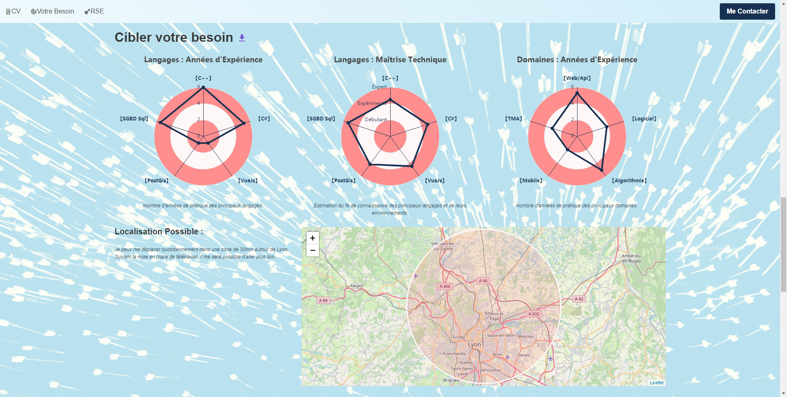

# Site Vitrine Micro Entreprise Emmanuel Trivis




## Description
Version 3 du site vitrine de la micro Entreprise Emmanuel Trivis.
Réalisé en Vuejs, Buefy, Echarts.
Site déployé en ServerLess via Netlify  **[Site Vitrine](https://emmanuel.trivis.fr/)** 

## Development interface


Is developed with **[vue.js](https://vuejs.org/)** 2.6.10 a Javascript framework and ECMAScript 6. Material Design **[Buefy](https://buefy.org/)**, Data Viz **[Echarts](https://echarts.apache.org/)**


## Project setup
```
npm install
```

### Compiles and hot-reloads for development
```
npm run serve
```

### Compiles and minifies for production
```
npm run build
```

### Lints and fixes files
```
npm run lint
```

### Customize configuration
See [Configuration Reference](https://cli.vuejs.org/config/).
